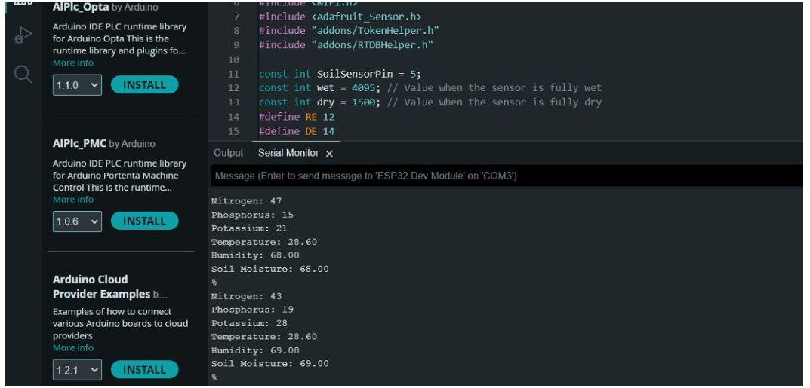

# precision-agriculture-system
🌾 Precision Agriculture System
This project is a smart farming solution designed to help farmers make informed decisions based on real-time data collected from their fields. Using IoT (Internet of Things) technology, the system continuously monitors environmental and soil conditions and provides crop recommendations to improve farming efficiency and yield.

🛠️ Key Features:
Sensor Integration:
The system uses various sensors to collect essential data:

Temperature Sensor – measures ambient temperature.

Humidity Sensor – checks moisture content in the air.

Soil NPK Sensor – measures the levels of Nitrogen (N), Phosphorus (P), and Potassium (K) in the soil.

Real-Time Data Monitoring:
Sensor data is collected by a microcontroller (e.g., ESP32/Arduino) and sent to a cloud platform (such as Firebase) in real time. This allows both farmers and researchers to view live updates through a web dashboard.

Crop Recommendation System:
Based on the collected data, the system intelligently recommends the most suitable crops for the current soil and environmental conditions. This helps the farmer decide what to plant for better growth and higher yield.

Web Interface:
A user-friendly web application displays the sensor data and recommended crops in a clear and organized manner.

🌐 Technologies Used:
Hardware: Sensors (Temperature, Humidity, NPK), ESP32/Arduino

Software: Embedded C / Python for sensor coding

Cloud: Firebase 

Frontend: HTML, CSS (for real-time data visualization)

🎯 Objectives:
Improve decision-making in agriculture using data-driven insights

Reduce the use of unnecessary fertilizers or wrong crop choices

Promote sustainable farming practices using affordable technology

📈 Impact:
This system aims to support small to medium-scale farmers by making precision agriculture accessible, affordable, and easy to use — helping them increase productivity while reducing environmental impact.

## 📊 Results
Content: This screenshot shows real-time sensor data from an Arduino serial monitor.
Data Includes: Likely temperature, humidity, soil moisture, or similar environmental parameters, typically used in precision farming or IoT projects.

